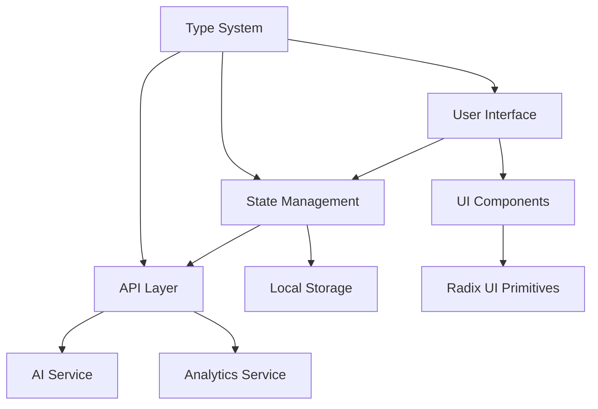

# 📚 Documentation Center

Welcome to the comprehensive documentation for the Color Palette Generator application. This documentation covers all aspects of the application including APIs, components, development workflows, and deployment strategies.

## 🗂️ Documentation Structure

### Core Documentation Files

#### 📖 [API Documentation](./API_DOCUMENTATION.md)
**Complete reference for all public APIs, functions, and components**

- **🔗 API Endpoints**: REST endpoints for palette generation and analytics
- **⚡ Server Actions**: AI-powered palette generation functions
- **🧩 Components**: All React components with props and usage examples
- **🪝 Custom Hooks**: Reusable React hooks for common functionality
- **📦 State Management**: Zustand store documentation
- **🛠️ Utility Libraries**: Helper functions and utilities
- **📊 Types & Interfaces**: TypeScript definitions
- **✅ Validation Schemas**: Zod validation schemas
- **💡 Usage Examples**: Real-world implementation examples

#### 🎨 [Components Guide](./COMPONENTS_GUIDE.md)
**Detailed guide for all UI and application components**

- **Core Application Components**: Main feature components
- **UI Components Library**: Reusable UI primitives
- **Form Components**: Input, textarea, select, and form controls
- **Layout Components**: Cards, alerts, separators, and containers
- **Navigation Components**: Breadcrumbs, tabs, and navigation
- **Modal & Overlay Components**: Dialogs, sheets, and popovers
- **Component Best Practices**: Patterns and optimization techniques

#### 🚀 [Development Guide](./DEVELOPMENT_GUIDE.md)
**Complete development, testing, and deployment workflow**

- **Development Setup**: Environment setup and prerequisites
- **Project Structure**: Codebase organization and architecture
- **Development Workflow**: Best practices and coding standards
- **Testing Guide**: Unit, integration, and E2E testing strategies
- **Performance Optimization**: Bundle analysis and optimization techniques
- **Deployment**: Production deployment strategies
- **Environment Configuration**: Environment variables and configuration
- **Troubleshooting**: Common issues and debugging techniques

---

## 🚀 Quick Start

### For Developers
1. Read the [Development Guide](./DEVELOPMENT_GUIDE.md) for setup instructions
2. Review the [Components Guide](./COMPONENTS_GUIDE.md) for UI patterns
3. Reference the [API Documentation](./API_DOCUMENTATION.md) for implementation details

### For Designers
1. Explore the [Components Guide](./COMPONENTS_GUIDE.md) for available UI components
2. Review component props and usage examples
3. Understand the design system and styling patterns

### For Product Managers
1. Review the [API Documentation](./API_DOCUMENTATION.md) for feature capabilities
2. Understand the application architecture and data flow
3. Check deployment requirements in the [Development Guide](./DEVELOPMENT_GUIDE.md)

---

## 🎯 Key Features Documented

### 🤖 AI-Powered Color Generation
- **Image Analysis**: Extract palettes from uploaded images using Google Gemini AI
- **Text-to-Palette**: Generate palettes from natural language descriptions
- **Intelligent Editing**: Modify existing palettes with AI assistance
- **Color Theory**: Advanced color harmony and accessibility compliance

### 🎨 Interactive User Interface
- **Drag & Drop Upload**: Intuitive image upload experience
- **Real-time Preview**: Live palette generation and editing
- **Mobile Responsive**: Optimized for all device sizes
- **Accessibility First**: WCAG 2.1 AA compliant design

### 💾 Persistent Storage
- **Local Storage**: Client-side palette persistence
- **Favorites System**: Mark and organize favorite palettes
- **Export Options**: Download palettes as CSS or JSON
- **Share Functionality**: Native Web Share API integration

### 🔧 Developer Experience
- **Type Safety**: Full TypeScript implementation
- **Component Library**: Reusable UI components with Radix UI
- **State Management**: Zustand for predictable state handling
- **Testing Suite**: Comprehensive test coverage with Jest

---

## 📊 Architecture Overview



### Technology Stack

#### Frontend
- **Next.js 15**: React framework with App Router
- **React 19**: Latest React with concurrent features
- **TypeScript**: Type-safe development
- **Tailwind CSS v4**: Utility-first CSS framework
- **Radix UI**: Accessible component primitives

#### State & Data
- **Zustand**: Lightweight state management
- **Zod**: Schema validation and type inference
- **Local Storage**: Client-side persistence

#### AI & APIs
- **Google Gemini AI**: Advanced image analysis and color extraction
- **Vercel AI SDK**: Streamlined AI integration
- **PostHog**: Analytics and feature flags

#### Development
- **pnpm**: Fast, efficient package management
- **ESLint**: Code quality and consistency
- **Prettier**: Code formatting
- **Jest**: Testing framework
- **Husky**: Git hooks for quality gates

---

## 🔍 API Reference Quick Links

### Primary Endpoints
- **POST** `/api/generate` - Generate color palettes
- **GET** `/api/generate` - Health check
- **POST** `/api/analytics` - Submit performance metrics

### Core Functions
- `generateColorPalette()` - Main AI generation function
- `useColorPaletteStore()` - Global state management
- `useIsMobile()` - Responsive design hook
- `useToast()` - Notification system

### Key Components
- `<ImageUpload />` - Main upload interface
- `<ColorPaletteDisplay />` - Palette viewer
- `<ColorCard />` - Individual color display
- `<SavedPalettes />` - Palette library

---

## 📝 Usage Examples

### Generate Palette from Image
```typescript
import { generateColorPalette } from '@/app/actions';

const palette = await generateColorPalette(
  imageDataUrl,
  5, // number of colors
  'warm sunset tones' // optional prompt
);
```

### Component Usage
```tsx
import { ImageUpload, ColorPaletteDisplay } from '@/components';

function App() {
  const handleGenerate = async (prompt?: string) => {
    // Generation logic
  };

  return (
    <div>
      <ImageUpload onGeneratePalette={handleGenerate} />
      <ColorPaletteDisplay state="show" />
    </div>
  );
}
```

### State Management
```tsx
import { useColorPaletteStore } from '@/lib/store';

function PaletteManager() {
  const {
    colorPalette,
    savedPalettes,
    savePalette,
    loadSavedPalette
  } = useColorPaletteStore();

  // Use palette data and actions
}
```

---

## 🎯 Best Practices Summary

### Component Development
- Use TypeScript for all components
- Implement proper accessibility attributes
- Follow the established naming conventions
- Include comprehensive prop interfaces
- Write tests for all public interfaces

### State Management
- Keep state flat and normalized
- Use Zustand actions for all mutations
- Implement proper error handling
- Persist important data with middleware

### Performance
- Lazy load heavy components
- Optimize images with Next.js Image component
- Use React optimization hooks appropriately
- Monitor bundle size and Core Web Vitals

### Testing
- Write tests for all public APIs
- Test component behavior, not implementation
- Use React Testing Library best practices
- Maintain high test coverage standards

---

## 🔗 Additional Resources

### External Documentation
- [Next.js Documentation](https://nextjs.org/docs)
- [React Documentation](https://react.dev)
- [Tailwind CSS](https://tailwindcss.com/docs)
- [Radix UI](https://www.radix-ui.com/primitives)
- [Zustand](https://zustand-demo.pmnd.rs/)
- [Google AI SDK](https://ai.google.dev/)

### Development Tools
- [TypeScript Handbook](https://www.typescriptlang.org/docs/)
- [Jest Documentation](https://jestjs.io/docs/getting-started)
- [Testing Library](https://testing-library.com/docs/)
- [Zod Documentation](https://zod.dev/)

---

## 📞 Support & Contributing

### Getting Help
- **GitHub Issues**: Report bugs and request features
- **Discussions**: Community support and questions
- **Documentation**: Comprehensive guides and examples

### Contributing Guidelines
1. Read the [Development Guide](./DEVELOPMENT_GUIDE.md)
2. Follow the established code patterns
3. Write tests for new functionality
4. Update documentation for API changes
5. Submit pull requests with clear descriptions

### Documentation Updates
- Keep documentation in sync with code changes
- Use clear, concise language
- Include practical examples
- Follow the established documentation structure

---

**This documentation is actively maintained and updated with each release. For the most current information, always refer to the latest version in the repository.**